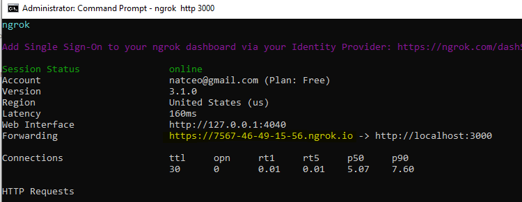
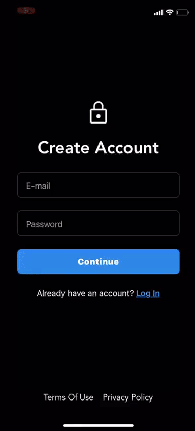
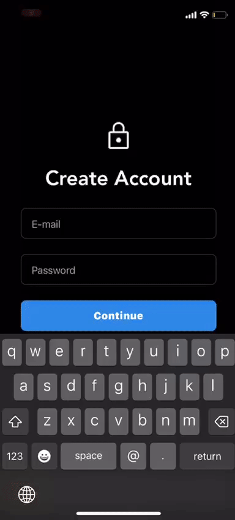

# Login screen with RN + NestJS + MongoDB

## Setup

### localhost to ip with ngrok

1. Create account on ngrok
2. Download and install `ngrok` .zip file. `./ngrok` in the repository.
3. Where unzipped, run command `ngrok config add-authtoken <auth key goes here>`. you can find the key in ngrok dashboard.
4. This starts ngrok and makes translation of your `localhost` to external url `./ngrok http 3000`
5. Now, since your ngrok url is generated, the ui will look like this:

6. If all went well, you have to copy the url that is generated. In my case it is: `https://7567-46-49-15-56.ngrok.io`, which needs to be replaced inside `./mobile/config/env.ts` file under the variable `API_URL`.

### Backend

It's expected that you have Node running on your environemtn and nestjs installed as a global package, with MongoDb. In my case mongo's root URL is `mongodb://localhost/TestDatabase`. What means that the DB has to be named as `TestDatabase`.

## Start Backend

Since the backend's localhost is sent to external url, ngrok, that we fired before, needs to keep executing.

1. from main directory `cd ./backend`
2. `npm i`
3. `npm start`

## Start React Native app on Expo

1. from main directory `cd ./mobile`
2. `npm i`
3. `npm start`
4. download Expo app for your mobile
5. Scan the QR code that `npm start` had generated.

You are good to go.  

